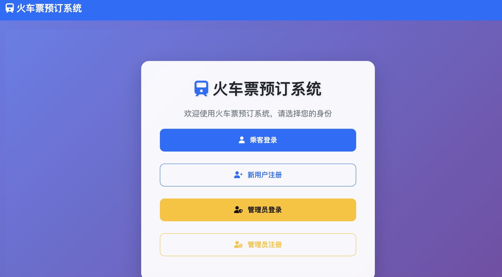

# 🚄 Railway Ticket Booking System — Full-Stack Web App

[](https://railway-booking-system-webpage.onrender.com/)
[](https://nodejs.org/)
[](https://expressjs.com/)
[](https://www.sqlite.org/)
[](https://getbootstrap.com/)
[](LICENSE)

<div align="center">

**🌐 [📖 简体中文版](README.zh-CN.md)**

</div>

---

## 📸 Preview

<div align="center">

</div>

---

### Overview

A **full-stack railway ticket booking web application** built with **Node.js**, **Express.js**, and **SQLite**. Features real Chinese railway station network data, bidirectional route search, real-time seat management, user authentication, admin dashboard, and a responsive **Bootstrap** UI. **Deployed live on Render.**

🔗 **Live Demo**: [https://railway-booking-system-webpage.onrender.com/](https://railway-booking-system-webpage.onrender.com/)

### Features

#### 🔐 User Management
- User registration and login with secure password validation
- Account balance management and recharge

#### 🎟️ Ticket Management
- Search trains by departure and arrival stations
- Real-time seat availability checking
- Ticket booking and cancellation

#### 👨‍💼 Admin Features
- Admin registration with special access code
- Train management (suspend / resume services)
- User management (ban / unban / delete users)

#### 🔍 Advanced Search
- Bidirectional route searching
- Date-based ticket availability

### Tech Stack

| Layer | Technology |
|-------|-----------|
| **Runtime** | Node.js 18.x |
| **Backend** | Express.js 4.18.2 |
| **Database** | SQLite |
| **Frontend** | HTML5, CSS3, JavaScript (ES6+), Bootstrap 5 |
| **Deployment** | Render |

### Project Structure

```
railway-booking-system-webpage/
├── README.md
├── README.zh-CN.md
├── LICENSE
├── new_trains.txt                    # Train schedule data
├── image/
│   └── overview.png                  # Project overview screenshot
├── data-plaintext/                   # Plain-text seed data
└── web/                              # Main application
    ├── server.js                     # Express server entry point
    ├── database.js                   # Database operations
    ├── package.json                  # Dependencies
    ├── railway.db                    # SQLite database (auto-generated)
    ├── public/                       # Static frontend files
    │   ├── index.html                # Main homepage
    │   ├── script.js                 # Client-side JavaScript
    │   └── styles.css                # CSS styling
    ├── data/                         # JSON seed data
    │   ├── trains.json
    │   ├── stations.json
    │   ├── users.json
    │   ├── admins.json
    │   └── suspended_trains.json
    ├── scripts/                      # Utility & startup scripts
    └── tests/                        # Test & debug files
```

### Quick Start

#### Prerequisites
```bash
node --version  # 18.x or higher
npm --version   # 8.x or higher
```

#### Install & Run
```bash
git clone https://github.com/kent234535/railway-booking-system-webpage.git
cd railway-booking-system-webpage/web
npm install
npm start
```

Open [http://localhost:3000](http://localhost:3000) in your browser.

### API Endpoints

#### User Authentication
| Method | Endpoint | Description |
|--------|----------|-------------|
| `POST` | `/api/register` | User registration |
| `POST` | `/api/login` | User login |
| `POST` | `/api/logout` | User logout |

#### Train Operations
| Method | Endpoint | Description |
|--------|----------|-------------|
| `GET` | `/api/search` | Search trains |
| `POST` | `/api/purchase` | Book tickets |
| `POST` | `/api/refund` | Cancel tickets |

#### Admin Operations
| Method | Endpoint | Description |
|--------|----------|-------------|
| `POST` | `/api/admin/register` | Admin registration |
| `POST` | `/api/admin/login` | Admin login |
| `POST` | `/api/admin/suspend-train` | Suspend train |
| `POST` | `/api/admin/resume-train` | Resume train |

### Deployment

The app is deployed on **Render**. To deploy your own:

1. Fork this repository
2. Connect to Render
3. Set **root directory**: `web`
4. Set **build command**: `npm install`
5. Set **start command**: `npm start`

### Contributing
1. Fork the repository
2. Create a feature branch (`git checkout -b feature/amazing`)
3. Commit your changes
4. Push to the branch
5. Open a Pull Request

### License

MIT License — see [LICENSE](LICENSE) for details.

---

## 🏷️ Keywords

`railway booking system` · `train ticket` · `Node.js` · `Express.js` · `SQLite` · `full-stack` · `web application` · `REST API` · `Bootstrap` · `real-time seat management` · `火车票预订` · `全栈应用`

---

<div align="center">

⭐ **Star this repo if you find it useful!** ⭐

</div>
